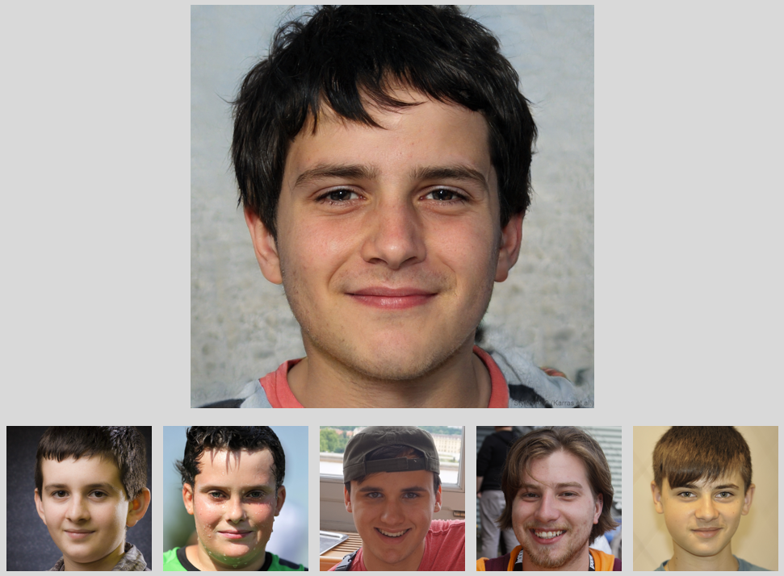
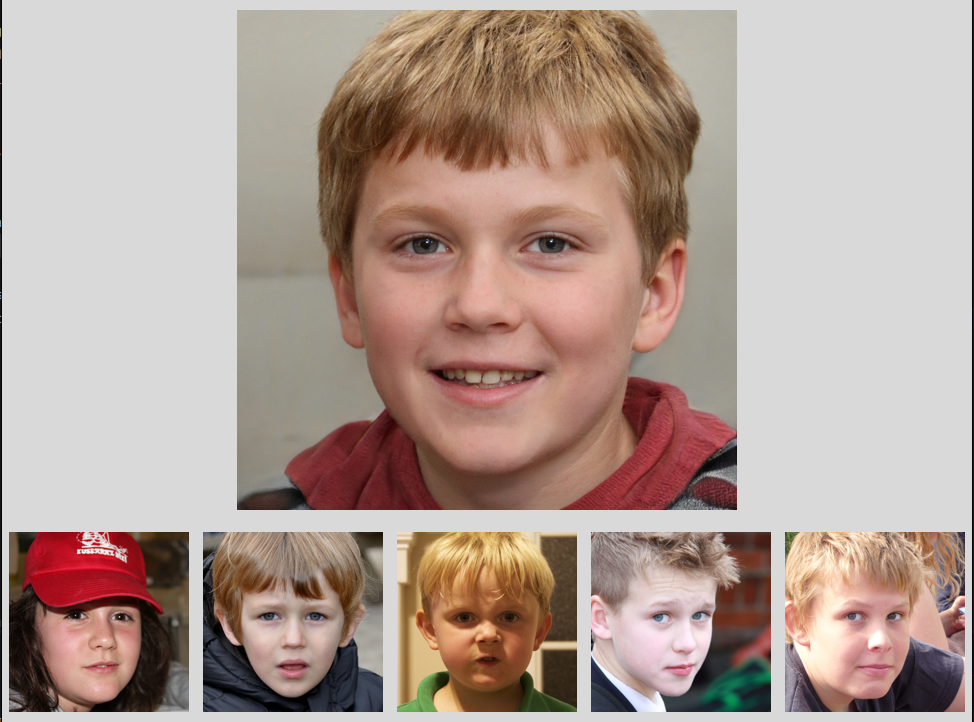

# Find my doppelgänger 

Utilises facial embeddings and a Postgres (pgvector) database / cosine similarity to find the face that most closely resembles the query face. Dataset contains 70k faces from FFHQ (more info below), pre-embedded using Facenet512.

---

# Tech stack
- Python 3.12
- Deepface / Facenet512
- Postgres / pgvector
- NVLabs FFHQ dataset
- Tkinter

# Demo
All query images used for these demos were generated using [thispersondoesnotexist.com](https://thispersondoesnotexist.com/) for privacy reasons, and results are from the ffhq dataset. The query image is the large one on top, and the results are the 5 smaller images.






--- 

# Prerequisites

- PostgreSQL
- pgvector
- Python 3.12
- faceapp_full.dump (For installation option 1)
- internet connection

#### Recommended:
- CUDA toolkit

--- 

# Installation
commands shown are for Linux systems
### Clone the repository and set up the environment:
```
git clone https://github.com/raffayrowland/find-my-doppelganger.git 
cd find-my-doppelganger
pip install -r requirements.txt
touch .env
```

### Option 1: get data from dump (recommended)

Download the [dump](https://drive.google.com/file/d/1Awg18xHBh2k06sL-CIE_vcBH25fMevDi/view?usp=sharing) from Google Drive, then run this:

```
sudo -u postgres createdb faceapp
sudo -u postgres pg_restore -d faceapp --no-owner --no-privileges faceapp_full.dump
```
Run inside psql:
```
\c faceapp
CREATE ROLE faceapp WITH LOGIN PASSWORD 'faceapp_password';
ALTER TABLE faces OWNER TO faceapp;
```

#### Add this line to your .env file:
```
DB_PASSWORD="faceapp_password"
```

The images are hosted on Google Drive, so no need to download the full dataset locally

### Option 2: use your own data

#### Set up Postgres database:
```
createuser -P faceapp  -- Set password and remember it
createdb -O faceapp faceapp
```
#### Run inside the faceapp database:
```
psql -d faceapp -f setup.sql
```
#### Add this line to your .env file:
```
DB_PASSWORD="{insert your db password here}"
```

--- 

# Dataset
- Used Nvidia's FFHQ dataset
- Specifically, the 1024x1024 portion
- [Dataset repo](https://github.com/NVlabs/FFHQ-dataset)

--- 

## Citations

If you use this project in academic work, please cite:

- DeepFace (library used to generate/query embeddings; FaceNet512 via DeepFace):
  - Serengil, S. I., & Ozpinar, A. (2020). *LightFace: A Hybrid Deep Face Recognition Framework*. 2020 Innovations in Intelligent Systems and Applications Conference (ASYU). DOI: 10.1109/ASYU50717.2020.9259802
  - (Optional) Serengil, S. I., & Ozpinar, A. (2021). *HyperExtended LightFace: A Facial Attribute Analysis Framework*. 2021 International Conference on Engineering and Emerging Technologies (ICEET). DOI: 10.1109/ICEET53442.2021.9659697

- FaceNet (embedding model):
  - Schroff, F., Kalenichenko, D., & Philbin, J. (2015). *FaceNet: A Unified Embedding for Face Recognition and Clustering*. CVPR 2015. arXiv:1503.03832

- FFHQ dataset:
  - Karras, T., Laine, S., & Aila, T. (2019). *A Style-Based Generator Architecture for Generative Adversarial Networks*. CVPR 2019. arXiv:1812.04948
  - Also cite the FFHQ repository / metadata if appropriate.

- HNSW (ANN index used by pgvector):
  - Malkov, Y. A., & Yashunin, D. A. (2016). *Efficient and robust approximate nearest neighbor search using Hierarchical Navigable Small World graphs*. arXiv:1603.09320

- pgvector (vector similarity search in Postgres):
  - Kane, A. *pgvector: Open-source vector similarity search for Postgres*. GitHub repository: https://github.com/pgvector/pgvector
